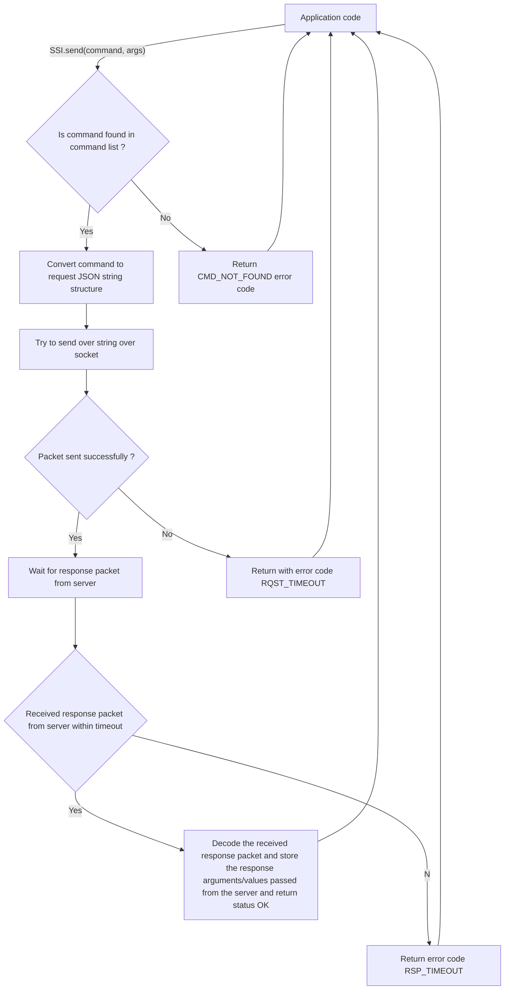
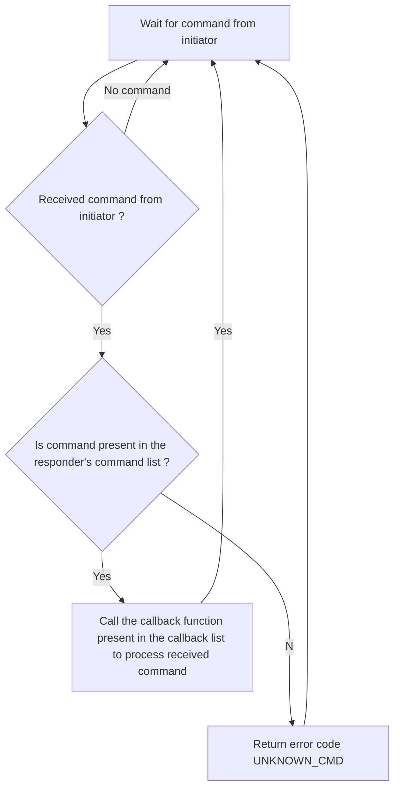

# Simple Socket Interface

This is a simple request-response based protocol in which a request message containing a command name and arguments (as strings) are passed via one socket and response is read through another socket. Whenever the receiver detectes a command being sent, it will call a suitable callback function in its application layer and send over a response message.

## Request packet syntax

{type: "request", command: "__command_name__", cmdargs: ["__arg1__", "__arg2__", "__arg3__", ..., "__argn__" ]}

**type**: Indicates the type of the message (request/response)

**command**: Name of the command/function to be executed in the receiver. The receiver extracts this string and compares it against available commands in its command table.

**cmdargs**: The arguments for the command in the form of strings.

## Response packet syntax

The receiver sends its response through the second socket in the following format:

{type: "response", command: "__command_name__", retargs: ["__arg1__", "__arg2__", "__arg3__", ..., "__argn__" ]}

**type**: Indicates the type of the message (request/response)

**command**: Name of the command/function to be executed in the receiver. The receiver extracts this string and compares it against available commands in its command table.

**retargs**: The value of the return arguments in string format

## Software flow

Initiator side software flow



Responder side software flow



## Public facing APIs

Role enum

```Python
SSI.role = { SSI_ROLE_INITIATOR, SSI_ROLE_RESPONDER }
```

**SSI_ROLE_INITIATOR**: Indicates that the node is a initiator node.

**SSI_ROLE_RESPONDER**: Indicates that the node is a responder node.

Status words

```Python
SSI.status = { SSI_OK, SSI_CMD_NOT_FOUND, SSI_RQST_TIMEOUT, SSI_RSP_TIMEOUT, SSI_CMD_DUPLICATE}
```

**SSI_OK**: Everything is okay with the processing of simple socket interface stack.

**SSI_CMD_NOT_FOUND**: The command is not found in the command list.

**SSI_RQST_TIMEOUT**: Timeout on sending request message via sender socket.

**SSI_RSP_TIMEOUT**: Timeout on receiving response message via receiver socket.

**SSI_CMD_DUPLICATE**: Command is a duplicate command.

```Python
SSI.open(role: SSI.role)
```


Open a socket connection with a 

```Python
SSI.add_command(command: str,callback)
```

Register a command and the respective callback function to the command list.

**command**: The name of the command to be added to the command list in string format.

**callback**: The callback function to be called when that target **command** is received.

```Python
SSI.remove_command(command: str)
```

Remove command from the command list.

**command**: The name of the command to be removed from the command list.


```Python
SSI.send(command: str, args: List[string]) -> SSI.status
```

**command**: Name of the command to be processed.

**args**: Arguments to be passed along with the command.

```Python
SSI.process()
```

This function is called only by the **responder**. This function reads the incoming byets from the receiver socket and sends out the response via the response socket to the initiator.